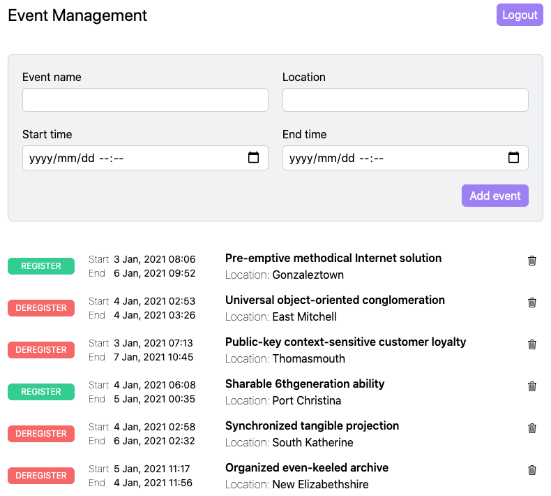

# app-event-management-ui

[](https://github.com/shihanng/app-event-management-ui/actions?query=workflow%3A%22Run+test%22)

UI for <https://github.com/shihanng/app-event-management>.

## Local development environment

Run server following instructions in <https://github.com/shihanng/app-event-management>.

```console
yarn install
yarn start
```

Visit <http://localhost:3000/>


